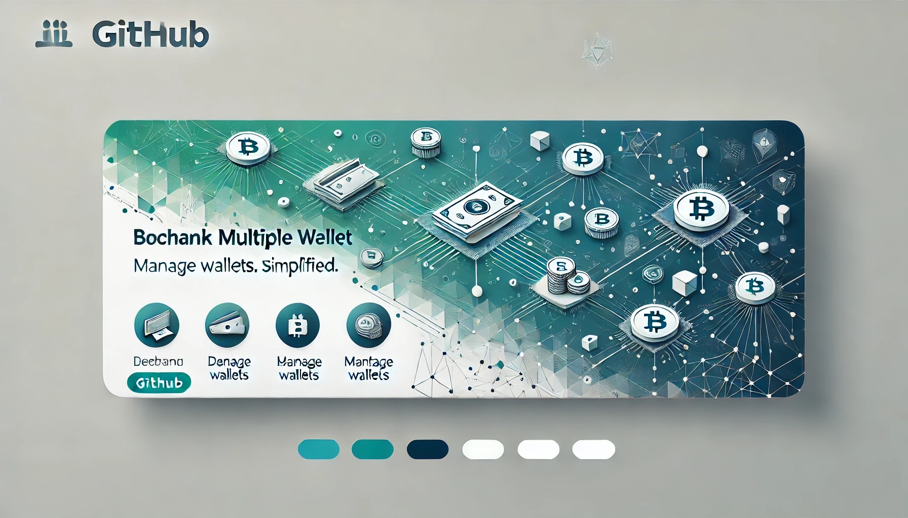

# Debank Multiple Wallet

<div align="center">
  
</div>


## ✨ Features

-   Get Total Balance from multiple wallets


## 🚀 Quick Start


```bash
npm install && npm start
```

### how to change wallet sources?

edit source.json

### if not working, install this package

```bash
npm install --save-dev selenium-webdriver
npm install --chromedriver
npm install chromedriver --chromedriver_version=LATEST
```

